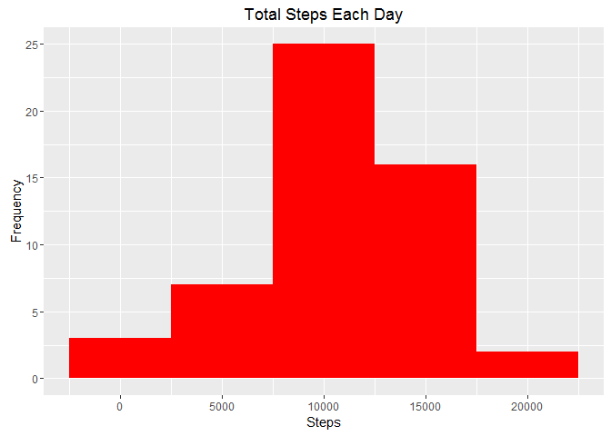
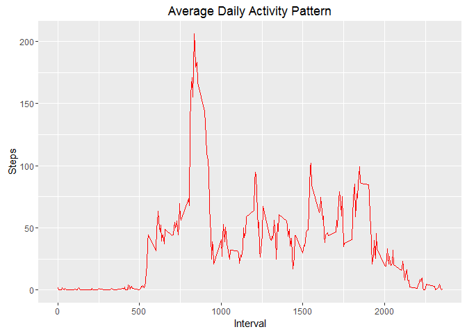
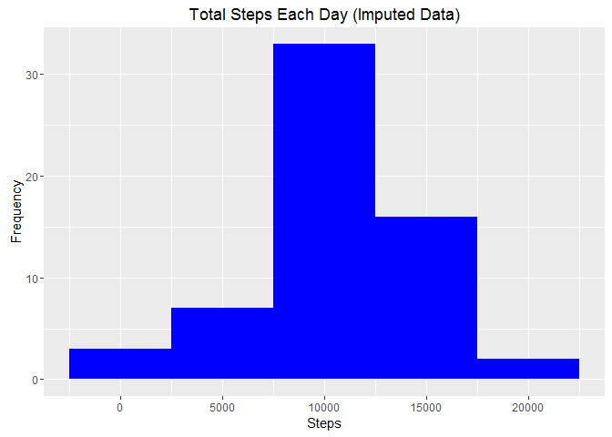
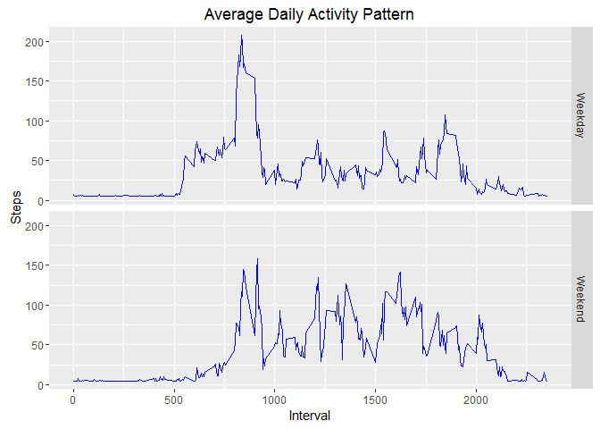

# Reproducible Research: Peer Assessment 1

In this assignment the following is carried out;  
1. The data would be read in an appropriate format.   
2. Create a histogram of the total number of steps taken each day.  
3. Calculate the mean and median number of steps taken each day.  
4. Create a time series plot of the average number of steps taken each day.  
5. Determine which 5 minute interval contains the maximum number of steps.  
6. Create and codify strategy for imputing missing data in a new data set.  
7. Create a histogram of the total number of steps taken each day in the new data set.  
8. Create a panel plot to compare weekday and weekend average number of steps.  


## Set global options and load required libraries for the assignment

```r
library(ggplot2)  
library(knitr)  
options("scipen" = 100)
opts_chunk$set(echo = TRUE, results = "hold")  
```
  
  
## Loading and preprocessing the data
Forked & Cloned the required Git Hub repository created for this assignment.  
Unzipped "activity zip" to the the default working directory.  

```r
unzip("activity.zip")
```
  
Read the "activity csv" file into "actdata" data frame.  

```r
actdata <- read.csv("activity.csv")  
```
  
Display the structure of "actdata" data frame.  

```r
str(actdata)  
```

```
## 'data.frame':	17568 obs. of  3 variables:
##  $ steps   : int  NA NA NA NA NA NA NA NA NA NA ...
##  $ date    : Factor w/ 61 levels "2012-10-01","2012-10-02",..: 1 1 1 1 1 1 1 1 1 1 ...
##  $ interval: int  0 5 10 15 20 25 30 35 40 45 ...
```
  
The variable "date" is a factor and is converted to POSIXct class  

```r
actdata$date <- as.Date(actdata$date)  
```
  
  
## What is mean total number of steps taken per day?
Create a new data frame using aggregate () which totals the steps for each day. The missing values (NA) will be ignored.  

```r
totalsteps <- aggregate(steps ~ date, actdata, sum)  
```
  
Display the structure of "totalsteps" data frame.  

```r
str(totalsteps)  
```

```
## 'data.frame':	53 obs. of  2 variables:
##  $ date : Date, format: "2012-10-02" "2012-10-03" ...
##  $ steps: int  126 11352 12116 13294 15420 11015 12811 9900 10304 17382 ...
```
  
Plot the histogram  

```r
ggplot(totalsteps, aes(x = steps)) + 
        geom_histogram(fill = "red", binwidth = 5000) + 
        labs(title = "Total Steps Each Day", x = "Steps", y = "Frequency")  
```

<!-- -->
  
Calculate the mean total number of steps taken per day.  

```r
Mean1 <- round(mean(totalsteps$steps), digits = 0)  
```

Calculate the median total number of steps taken per day.  

```r
Median1 <- round(median(totalsteps$steps), digits = 0)  
```

The mean is 10766 steps and the median is 10765 steps.  
  
  
## What is the average daily activity pattern?
Create a new data frame using aggregate () which averages the steps for each interval. The missing values (NA) will be ignored.  

```r
AVGDAP <- aggregate(steps ~ interval, actdata, mean, na.rm = TRUE)  
```
  
Display the structure of "AVGDAP" data frame.  

```r
str(AVGDAP)  
```

```
## 'data.frame':	288 obs. of  2 variables:
##  $ interval: int  0 5 10 15 20 25 30 35 40 45 ...
##  $ steps   : num  1.717 0.3396 0.1321 0.1509 0.0755 ...
```
  
Make a time series plot of the 5-minute interval (x-axis) &  the average number of steps taken, averaged across all days (y-axis).  

```r
ggplot(AVGDAP, aes(x = interval, y = steps)) +
        geom_line(colour = "red") +
        labs(title = "Average Daily Activity Pattern", x = "Interval",
             y = "Steps")  
```

<!-- -->
  
Determine which 5 minute interval contains the maximum number of steps.  

```r
MAXAVGDAP <- AVGDAP[which.max(AVGDAP$steps),]  
```

Interval 835 contains on the average the maximum number of  steps which is 206.  
  
  
## Imputing missing values
There are a number of days/intervals where there are missing values. The presence of missing days may introduce bias into some calculations or summaries of the data.

Calculating the total number of missing values in the data set.  

```r
Miss1 <- sum(is.na(actdata))  
```

There are a total of 2304 missing values in the "actdata" data frame.  
  
To avoid bias in the calculations the missing values will be imputed with the mean for that day. A new data frame will be created for this.  

```r
actdata_imp <- transform(actdata, 
                             steps = ifelse(is.na(steps), 
                                            round(mean(steps, na.rm = TRUE)), 
                                            steps))  
```
  
Verify if new data frame "act_imp" has any missing values.  

```r
Miss2 <- sum(is.na(actdata_imp))  
```

The new data frame "actdata_imp" has 0 missing values.  
  
Display the structure of "actdata_imp" data frame.  

```r
str(actdata_imp)  
```

```
## 'data.frame':	17568 obs. of  3 variables:
##  $ steps   : num  37 37 37 37 37 37 37 37 37 37 ...
##  $ date    : Date, format: "2012-10-01" "2012-10-01" ...
##  $ interval: int  0 5 10 15 20 25 30 35 40 45 ...
```
  
Create a new data frame using aggregate () which totals the steps for each day for the data frame "actdata_imp" with the imputed missing values.  

```r
totalsteps_imp <- aggregate(steps ~ date, actdata_imp, sum)  
```
  
Display the structure of "totalsteps_imp" data frame.  

```r
str(totalsteps_imp)  
```

```
## 'data.frame':	61 obs. of  2 variables:
##  $ date : Date, format: "2012-10-01" "2012-10-02" ...
##  $ steps: num  10656 126 11352 12116 13294 ...
```
  
Plot the histogram for the imputed data frame.  

```r
ggplot(totalsteps_imp, aes(x = steps)) + 
        geom_histogram(fill = "blue", binwidth = 5000) + 
        labs(title = "Total Steps Each Day (Imputed Data)", x = "Steps",
             y = "Frequency")  
```

<!-- -->
  
Calculate the mean total number of steps taken per day.  

```r
Mean2 <- round(mean(totalsteps_imp$steps))  
```
  
Calculate the median total number of steps taken per day.  

```r
Median2 <- round(median(totalsteps_imp$steps))  
```
  
The mean is 10752 steps and the median is 10656 steps for the imputed data frame.  
  
The impact of the imputed data has not changed the mean and median significantly. The mean decreased by 14 steps whereas the median also decreased by 109 steps.  
  
  
## Are there differences in activity patterns between weekdays and weekends?
Create a function to determine if weekday or weekend for a particular date.  

```r
TYPEDAY <- function(date) {
        d <- weekdays(date)
        if (d %in% c("Monday", "Tuesday", "Wednesday", "Thursday", "Friday"))
            return("Weekday")
        else if (d %in% c("Saturday", "Sunday"))
            return("Weekend")
        else
            stop("Invalid Date")
        }  
```
  
Create a variable called "day" with "weekday or weekend" factors in the data set "actdata_imp".  

```r
actdata_imp$day <- sapply(actdata_imp$date, FUN = TYPEDAY)  
```
  
Display the structure of "actdata_imp" data frame to check if variable "day" is present with factors "weekday or weekend"  

```r
str(actdata_imp)  
```

```
## 'data.frame':	17568 obs. of  4 variables:
##  $ steps   : num  37 37 37 37 37 37 37 37 37 37 ...
##  $ date    : Date, format: "2012-10-01" "2012-10-01" ...
##  $ interval: int  0 5 10 15 20 25 30 35 40 45 ...
##  $ day     : chr  "Weekday" "Weekday" "Weekday" "Weekday" ...
```
  
Create a new data frame using aggregate () which computes the average steps per day for weekend and weekdays.  

```r
totalsteps_tday <- aggregate(steps ~ interval + day, actdata_imp, mean)  
```
  
Make a panel plot of 2 time series plots of the 5-minute interval (x-axis) & the average number of steps taken, averaged across all days (y-axis).  

```r
ggplot(totalsteps_tday, aes(interval, steps)) + geom_line(colour = "blue") +
        facet_grid(day ~ .) + 
        labs(title = "Average Daily Activity Pattern", x = "Interval",
             y = "Steps")  
```

<!-- -->

There are differences in activities for weekdays and weekends. On weekdays, there's a large burst of activity just between 6am to 9am, but a smaller burst on weekends. Overall, there's consistent activity throughout the day on weekends than on weekdays.  

